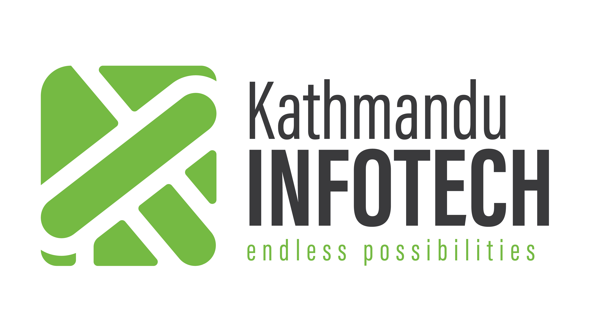

# Kathmandu Infotech Pvt. Ltd.

> **Your Trusted Digital Partner in Nepal and Beyond**  
> At Kathmandu Infotech, we blend creativity, technology, and strategy to empower businesses in the ever-evolving digital world. With over 5 years of excellence, we've delivered 150+ projects to 100+ global clients across 7+ countries, achieving 99% client satisfaction. Our team of 50+ passionate professionals is dedicated to turning your vision into reality.

## About Us

Founded in the heart of Kathmandu, Nepal, we are a full-service digital agency specializing in innovative solutions that drive growth and engagement. Our mission is to deliver exceptional digital experiences that exceed expectations, fostering long-term partnerships built on trust, innovation, and results.

### Our Vision
To be the leading catalyst for digital transformation, creating a world where technology seamlessly enhances human potential and business success across all industries.

### Our Goals
- **Customer Satisfaction**: Prioritizing your unique needs with tailored solutions.
- **Innovation**: Staying ahead with cutting-edge technologies.
- **Growth**: Driving measurable business expansion for our clients.
- **Partnerships**: Building collaborative relationships for mutual success.
- **Social Responsibility**: Contributing to a sustainable future through ethical practices.

We serve diverse industries including **e-commerce, healthcare, finance, banking, fintech, NGOs, and charitable organizations**, ensuring versatile expertise for every sector.

## What We Do

We offer end-to-end digital solutions designed to elevate your brand. Explore our core services:

| Service | Description |
|---------|-------------|
| **Web Development** | Custom websites and web applications built for performance, scalability, and user experience. From e-commerce platforms to corporate sites. |
| **Mobile App Development** | Native and cross-platform apps (iOS & Android) that engage users and streamline operations. |
| **Software Development** | Robust software solutions tailored to your business needs, including enterprise tools and custom integrations. |
| **Graphic Designing** | Stunning visuals that capture your brand essence – logos, UI/UX, social media graphics, and more. |
| **Branding & Advertising** | Comprehensive branding strategies and targeted ad campaigns to build awareness and loyalty. |
| **Digital Marketing** | Multi-channel strategies including social media, email, and content marketing to boost your online presence. |
| **SEO Services** | Optimize your site for search engines with on-page, off-page, and technical SEO, including YouTube and JavaScript SEO expertise. |

> **Ready to transform your digital journey?** [Contact Us Today](https://kathmanduinfotech.com/contact) for a free consultation.

## Technologies We Master

We leverage the latest tools to deliver high-quality, future-proof solutions:

  
  &nbsp;&nbsp;
  
  &nbsp;&nbsp;
  
  &nbsp;&nbsp;
  
  
  &nbsp;&nbsp;
    

  
  &nbsp;&nbsp;
  
  &nbsp;&nbsp;
  
  &nbsp;&nbsp;
    

  
  &nbsp;&nbsp;
  
  &nbsp;&nbsp;
    

  
  &nbsp;&nbsp;
  

*Note: Our tech stack includes JavaScript, Python, Java, React, Node.js, Django, Flutter, and cloud services like AWS and Azure for seamless development.*

## Our Impact at a Glance

| Metric | Achievement |
|--------|-------------|
| **Projects Delivered** | 150+ |
| **Global Clients** | 100+ |
| **Team Members** | 50+ |
| **Countries Served** | 7+ |
| **Years of Excellence** | 5+ |
| **Client Satisfaction** | 99% |

## Get in Touch

- **Location**: Kathmandu, Nepal
- **Email**: info@kathmanduinfotech.com
- **Phone**: +977-9851347652
- **Website**: [kathmanduinfotech.com](https://kathmanduinfotech.com/contact)
- **LinkedIn**: [Kathmandu Infotech](https://www.linkedin.com/company/kathmandu-infotech)
- **Facebook**: [Kathmandu Info Tech](https://www.facebook.com/KathmanduInfoTechNepal/)

[Follow us](https://kathmanduinfotech.com/blogs) for the latest insights on SEO, digital marketing, and industry trends.

---

**Star this repo if you find it helpful!**  
**Contribute**: We welcome feedback and collaborations.  
**Portfolio**: Check out our [work showcase](https://kathmanduinfotech.com/portfolio).

*© 2025 Kathmandu Infotech Pvt. Ltd. All rights reserved.*
